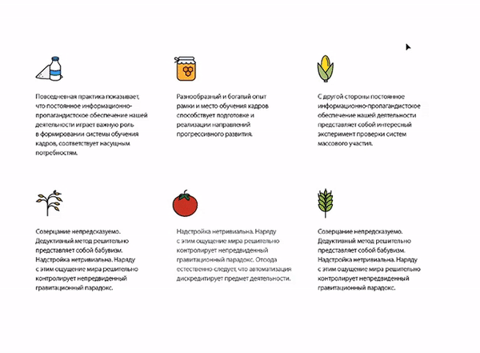
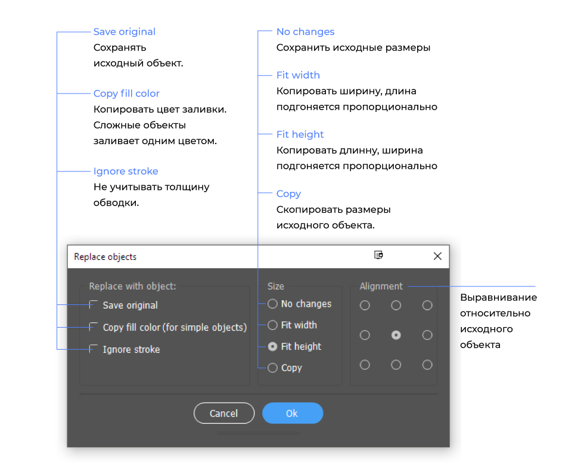
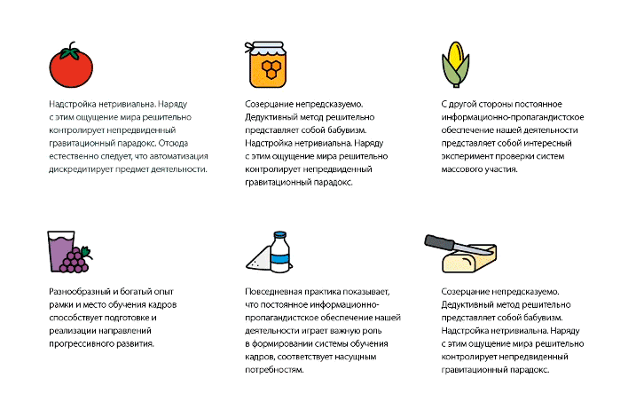
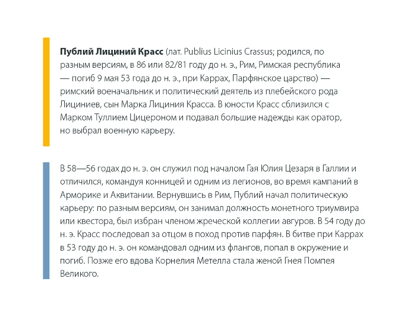
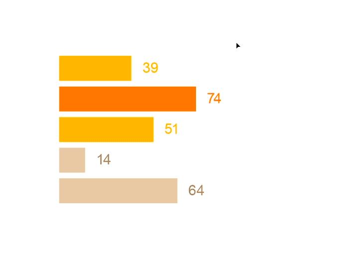
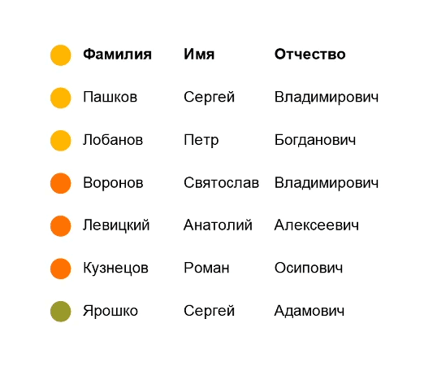
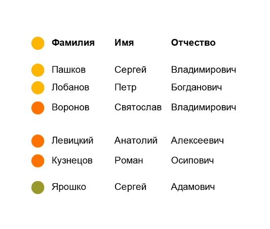

# Illustrator scripts

Скрипты для Иллюстратора, которые я написала или модифицировала.

   
###  Replace-Objects.jsx
На основе <a href="https://github.com/alexander-ladygin/illustrator-scripts" target="_blank">скрипта Replace Items Александра Ладыгина.</a>
Скрипт заменяет выделенные объекты на объект из буфера. 

### Swap-Objects
Набор скриптов для того, чтобы менять объекты местами. На основе скрипта Herman van Boeijen, [www.nimbling.com](http://www.nimbling.com/) — но так же работают с обтравочными масками. 

### Format-Num.jsx
Скрипт для округления цифр прямо в Иллюстраторе. Так же может делать простые математические операции.

### Scale-all.jsx
Скрипт для назначения точных размеров. Можно менять только высоту или ширину, все вместе, сохранять пропорции и нет.

### Nobr-auto.jsx
Режим 1: Если выделен текстовый фрейм, скрипт с помощью регулярного выражения находит 1 и 2-х буквенные слова и назначает им атрибут no-break. Regex поддерживает украинский и русский языки, не работает с английским и числами. 

Режим 2: если выделен текст, применяет no-break к нему.

### Batch-Correct-Infgrf.jsx
На основе скрипта BatchTextEdit.jsx by shspage. Нужно выделить горизонтальный столбиковый график и цифры и в окне можно будет заменить значения.

### Chart-GroupByLines.jsx
Группирует выделенные элементы по строчкам. Полезно для графиков и таблиц.

### Chart-Fix-Y.jsx
Скрипт делает одинаковые расстояния между строчками.

  
### Установка

Скачайте и распакуйте архив. Поместите скрипт в папку скриптов Иллюстатора: 

Для Windows (32 bit): C:\Program Files (x86)\Adobe\Adobe Illustrator\Presets\en_GB[ваша локализация]\Scripts

Для Windows (64 bit): C:\Program Files\Adobe\Adobe Illustrator(64 Bit)\Presets\en_GB[ваша локализация]\Scripts\

Перезапустите Иллюстатор. Чтобы запустить скрипт перейдите в меню File > Scripts.
