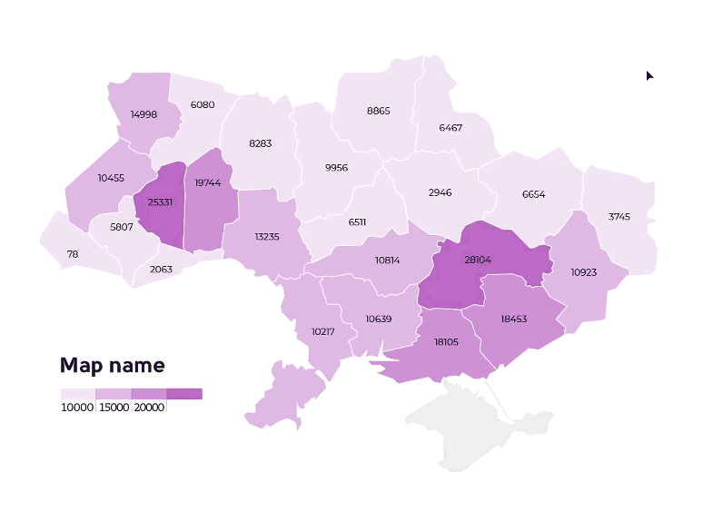

[Readme на русском здесь!](README_RU.md)

# Illustrator scripts

Scripts for the Illustrator, which I wrote or modified. Many scripts are made to speed up infographics creations. If you know how to improve them, write me, I will be glad :)

   
###  Replace-Objects.jsx
Based on <a href="https://github.com/alexander-ladygin/illustrator-scripts" target="_blank">Replace Items script by Alexander Ladygin.</a>
Script replaces selected objects with an object from the clipboard.  

### Swap-Objects
A set of scripts to swap objects in places. Based on the script by Herman van Boeijen, [www.nimbling.com](http://www.nimbling.com/). 

### Format-Num.jsx
Script for rounding up numbers right in the Illustrator. It can also do simple mathematical operations.

### Scale-all.jsx
Script for assigning precise sizes to objects.  You can change only height or width, all together, save proportions or not.

### Nobr-auto.jsx
Mode 1: When a text frame is selected, the script uses a regular expression to find one or two-letter words and assign them the no-break attribute. Regex supports Ukrainian and Russian, does not work with English and numbers. 

Mode 2: if text is selected, applies no-break to it.

### Batch-Correct-Infgrf.jsx
Based on BatchTextEdit.jsx by shspage. The script helps to quickly change values in simple charts.

### Chart-GroupByLines.jsx
Groups the selected elements by rows. Useful for charts and tables.

### Chart-Fix-Y.jsx
The script sets equal spacing between the rows.

### Quick-save.jsx
A script for quickly saving pictures in jpg and png format. By default, script saves the current artboard.

  
###  Installation

Download and unpack the archive. Place the script in the Illustrator scripts folder:

For Windows (32 bit): C:\Program Files (x86)\Adobe\Adobe Illustrator\Presets\en_GB[your localisation]\Scripts

For Windows  (64 bit): C:\Program Files\Adobe\Adobe Illustrator(64 Bit)\Presets\en_GB[your localisation]\Scripts\

Restart the Illustrator. To launch the script, go to the File > Scripts.
